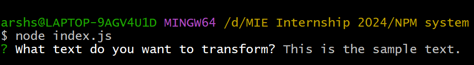
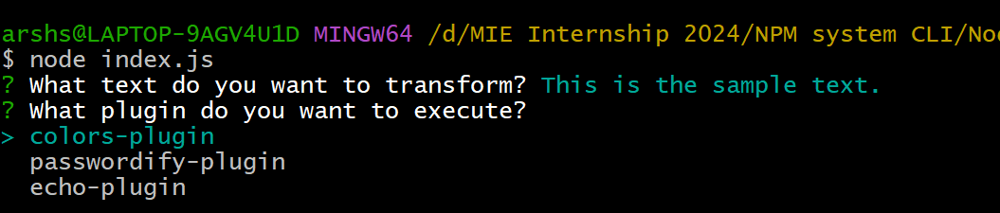
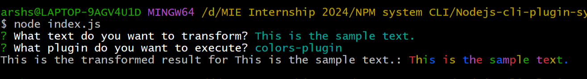
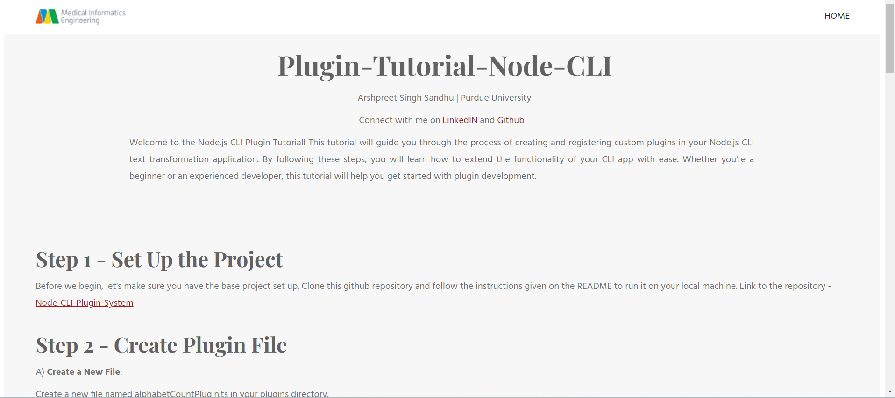

# Nodejs-cli-plugin-system
This project demonstrates a simple plugin system built with Node.js and TypeScript. It features a Command Line Interface (CLI) application that allows users to select and apply various text transformation plugins to input text. The system is designed to be modular and extensible, making it easy to add new plugins and extend functionality.


## Features

- **Pluggable Architecture**: Easily add or remove plugins to extend functionality.
- **Built with TypeScript**: Ensures type safety and better code maintainability.
- **Command Line Interface**: Simple and intuitive CLI for applying text transformations.
- **Modular Design**: Clear separation of concerns, making the codebase easier to understand and extend.

## Installation

### Prerequisites

- Node.js (v14 or later)
- npm (v6 or later)

### Steps

1. **Clone the repository:**

    ```bash
    git clone https://github.com/yourusername/text-cli.git
    cd text-cli
    ```

2. **Install dependencies:**

    ```bash
    npm install
    ```

3. **Build the project:**

    ```bash
    cd src
    npx tsc
    ```

## Usage

1. **Navigate to the build directory:**

    ```bash
    cd ../jsfiles
    ```

2. **Run the application:**

    ```bash
    node index.js
    ```

3. **Follow the prompts to enter the text and choose a plugin for transformation.**

## Example






## Want to Contribute?
Build Plugins of your Choice and create PR. It's easier than you think.
Refer to my website here to build your own plugin
[Plugin Tutorial](https://arshssandhu.github.io/Nodejs-cli-plugin-system/free-5345802.webadorsite.com/index.html)



## Resource I Used 

I found the following article extremely helpful in creating this system:
- [How to Build a Plugin System](https://stateful.com/blog/build-a-plugin-system-with-node)

## Acknowledgments

I want to express my gratitude to: <br>
**MIE**  My internship company for the opportunity and support throughout the project. <br>
**Doug Horner** The CEO,for his invaluable guidance and mentorship.<br>


